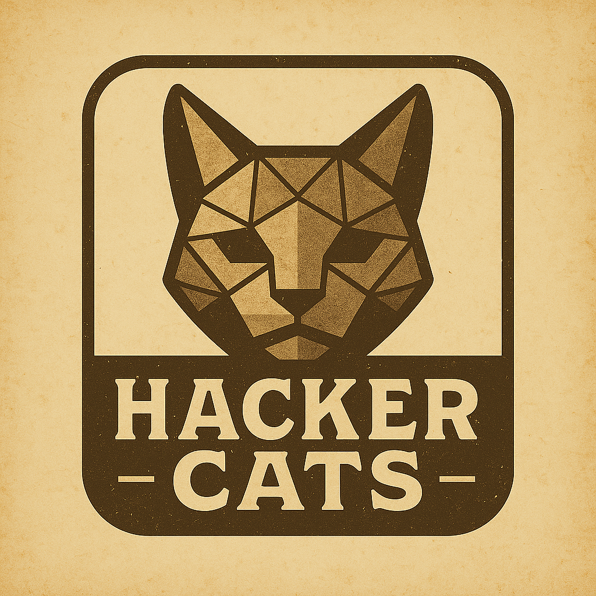

# 🐱‍💻 Hackercats Club Website

> **Live at**: [hackercats.club](https://hackercats.club)

A 90s-inspired retro hacker aesthetic website for the Hackercats college CTF team. Features a golden color scheme, pixel fonts, and terminal-style design with full responsive layout and accessibility support.



## 🚀 Quick Start

1. **Edit Content**: Modify the README.md files in the `src/` directories:
   - `src/about/README.md` - Club information
   - `src/events/README.md` - Events and activities  
   - `src/projects/README.md` - Member projects showcase
   - `src/stats/README.md` - CTF statistics template
   - `src/join/README.md` - How to join information

2. **Update CTF Stats**: Edit the YAML data file:
   - `src/data/ctf-stats.yaml` - Member stats, achievements, events

3. **Generate Site**: Run the generator to build HTML from markdown
   ```bash
   npm run build
   # or
   node generate.js
   ```

4. **Serve Locally**: Test your changes locally
   ```bash
   npm run serve
   # or
   python3 -m http.server 8000 --directory dist
   ```

5. **Deploy**: Push to GitHub - automatic deployment via GitHub Actions!

## 📁 Project Structure

```
website/
├── src/                    # Markdown content source
│   ├── about/README.md     # About section content
│   ├── events/README.md    # Events section content
│   ├── projects/README.md  # Projects section content
│   ├── join/README.md      # Join section content
│   └── README.md           # Main documentation
├── dist/                   # Generated static site
│   └── index.html          # Final HTML output
├── assets/                 # Static assets
│   ├── css/               # Custom styles
│   ├── js/                # JavaScript files
│   └── images/            # Images and media
├── generate.js            # Site generator script
├── package.json           # Project configuration
└── README.md              # This file
```

## ✨ Features

- **📝 Markdown-based**: Edit content using simple markdown files
- **🎨 Bulma CSS**: Beautiful, responsive design out of the box
- **⚡ Static**: Fast loading, easy to host anywhere
- **🔧 Customizable**: Easy to modify styles and layout
- **📱 Mobile-friendly**: Responsive design that works on all devices

## 🎨 Customization

### Styling
The site uses Bulma CSS framework. You can:
- Modify colors and themes by editing the HTML template
- Add custom CSS in `assets/css/`
- Change the color scheme by updating Bulma classes

### Content
- All content is managed through README.md files in the `src/` directory
- Supports standard markdown syntax
- Automatically converts to HTML with Bulma styling

### Layout
- Edit `dist/index.html` to modify the page structure
- The generator injects content into designated sections
- Navigation and hero section can be customized directly in the HTML

## 📦 Available Scripts

- `npm run build` - Generate static site from markdown
- `npm run serve` - Start local development server
- `npm run dev` - Build and serve in one command

## 🚀 Automated Deployment

**GitHub Pages + Custom Domain**: Fully automated!

1. **Push to GitHub**: Any push to `main` branch triggers deployment
2. **GitHub Actions**: Automatically builds and deploys the site
3. **Custom Domain**: Served at [hackercats.club](https://hackercats.club)
4. **SSL/HTTPS**: Automatically enabled by GitHub Pages

### Manual Deployment Options
The generated site in the `dist/` folder can also be deployed to:
- Netlify
- Vercel  
- Any static hosting service

Simply upload the contents of the `dist/` directory to your hosting provider.

### GitHub Pages Setup
1. Push this repository to GitHub
2. Go to repository Settings > Pages
3. Set source to "GitHub Actions"
4. Set custom domain to `hackercats.club`
5. Configure DNS: Add CNAME record pointing to `username.github.io`

## 🤝 Contributing

1. Edit the relevant README.md files in `src/`
2. Run `npm run build` to regenerate the site
3. Test locally with `npm run serve`
4. Commit your changes

## 📄 License

MIT License - feel free to use this for your own club website!